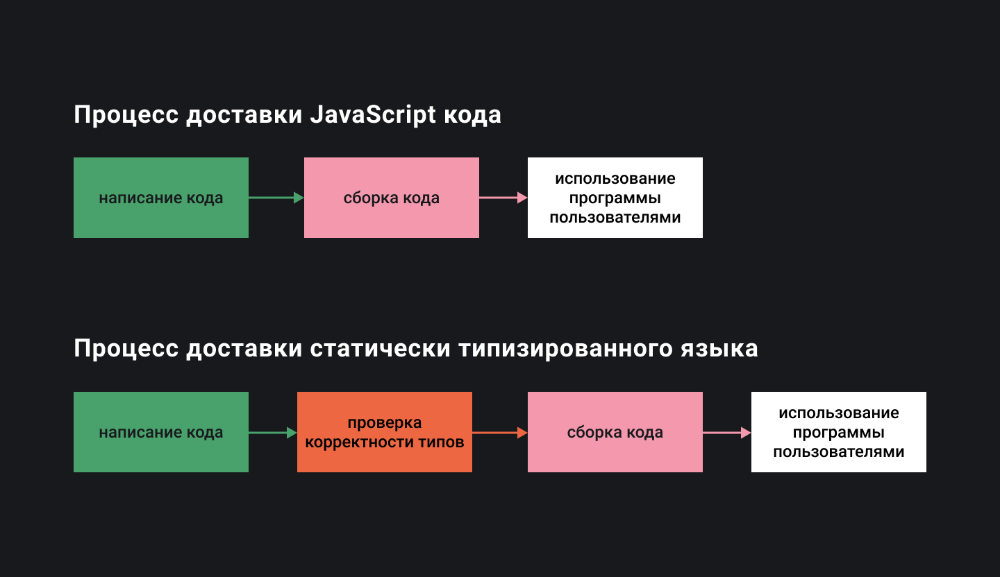

## Кратко

В JavaScript __слабая динамическая__ типизация. Это означает две вещи:

1. Любая переменная может произвольно менять свой тип во время выполнения программы.
2. При операциях с переменными разных типов, они будут автоматически приведены к одному типу.

Эти свойства языка часто мешают создавать большие надежные приложения. Поэтому появились решения, которые расширяют язык, добавляя в него строгую (запрет автоматического приведения типов) статическую (переменные не меняют свой тип) типизацию. Самое популярное решение в этой области — __TypeScript__. Другие, менее популярные, — Flow, Hegel.

## Как пользоваться

### Настройка

TypeScript — это язык, очень похожий на JavaScript. Браузеры и Node.js не умеют исполнять его, поэтому без шага сборки пользоваться им нельзя.

Все современные системы сборки умеют работать с TypeScript: Parcel поддерживает его без дополнительных манипуляций, для Webpack и Rollup есть плагины. Их объединяет одно — необходимо создать файл `tsconfig.js`, которые опишет, как превратить TypeScript-код в JavaScript-код. Правила создания конфигурационного файла описаны на [сайте TypeScript](https://www.typescriptlang.org/docs/handbook/tsconfig-json.html).

```javascript
{
  // ...
  "compilerOptions": {
    // Указываем папку, куда попадет результат
    "outDir": "./dist",
  },
  // Указываем, какие файлы следует компилировать
  "include": ["src/**/*"],
  // Внешние зависимости обычно исключают из списка компилируемых файлов
  "exclude": ["node_modules"]
  // ...
}
```

После этого, достаточно писать код в файлах с расширением `.ts` вместо `.js`.

### Язык

Главное отличие TypeScript от JavaScript — возможность добавлять аннотации типов к переменным, аргументами функций и их возвращаемым значениям.

```tsx
let age: number // теперь переменной age можно присвоить только число

age = 43 // будет работать

age = "34" // ошибка
```

Важно заметить, что ошибки несовпадения типов будут заметы уже на стадии написания кода. То есть, не нужно запускать программу, чтобы узнать, что в коде допущены ошибки с типизацией.

Проверка корректности типов — это разновидность статического анализа<!--TODO: ссылку на статический анализ-->. Его можно провести не запуская код.

Примерно таким же образом, можно типизировать параметры функции:

```tsx
function sayMyName(name: string) {
  console.log(`Привет, ${name}`)
}

sayMyName("Igor") // будет работать

sayMyName(42) // ошибка
```

Ошибка несовпадения типов будет заметна на этапе написания кода, и до запуска программы не дойдёт.

В TypeScript можно типизировать не только параметры функции, но и возвращаемое значение.

```tsx
function getCurrentDate(): Date {
  return new Date() // будет работать
}

function getCurrentDate(): Date {
  return "now" // ошибка
}
```

Другая особенность TypeScript — строгость типизации. Он запрещает операции с переменными разных типов, чтобы не допустить неоднозначности результата.

```tsx
const age = 43
const name = "Mary"

const result = age + name // ошибка, складывать числа и строки нельзя
```

## Как понять

TypeScript — надмножество JavaScript. На практике это означает, что любой JavaScript-код является корректным TypeScript-кодом. А вот обратное неверно.

Главное преимущество строгой статической типизации — возможность найти ряд ошибок еще на этапе написания кода. Например, классическая ошибка, когда в переменной не оказывается значения приводит в JavaScript ошибке во время выполнения, когда код уже работает в браузере. Такая ошибка может затронуть пользователей.

```tsx
function generateEmail(user) {
  return `${user.name}@mycompany.com`
}

// ...

// При вызове функции программист передает другой объект
generateEmail({ fullName: "Петр Сергеевич Никольский" })
// Ошибка времени выполнения, пользователь ее замечает
```

Если переписать этот пример на TypeScript, потенциальная проблема исчезнет:

```tsx
// Аргумент функции всегда должен быть объектом,
// у которого есть строковое поле name
function generateEmail(user: { name: string }) {
  return `${user.name}@mycompany.com`
}

// ...

// При вызове функции программист передает другой объект
generateEmail({ fullName: "Петр Сергеевич Никольский" })
// Ошибка времени сборки, программист ее замечает и исправляет
```

Чем раньше обнаруживается ошибка, тем легче ее исправить. Поэтому, статическая типизация, статический анализ<!--TODO: ссылку на статический анализ--> и написание автоматизированных тестов — это правила хорошего тона в современной разработке приложений. По сути, статическая типизация (как и статический анализ) добавляет в процесс разработки программы еще один шаг — проверку типов, который выполняется перед сборкой проекта и может помочь найти ошибки на раннем этапе.



На первый взгляд кажется, что явное объявление типов заставляет писать много лишнего кода. На самом деле, это иллюзия. Аннотации типов — способ обеспечить большую надёжность написанного кода.

TypeScript — это язык с опциональной типизацией. Он не заставляет программиста указывать типы, можно просто писать код как раньше. TypeScript постарается сам определить типы из контекста, и дать подсказки. Если контекст не понятен языку, он пометит тип переменной как `any`. Это означает, что в ней может лежать значение любого типа.

```tsx
const age = 12 // видимо, перменная должна иметь тип number

// язык не знает, какой тип имеет аругмент name
// он пометит его как any
function sayMyName(name) {
  console.log(`Привет, ${name}`)
}
```

Эта особенность языка называется выводом типов и присутствует во многих современных языках программирования. К сожалению, она не слишком развита в TypeScript, и чаще всего приходиться все-таки «подсказывать» компилятору типы. В других языках, например в Scala, она развита сильнее, там типы приходится указывать значительно реже.
